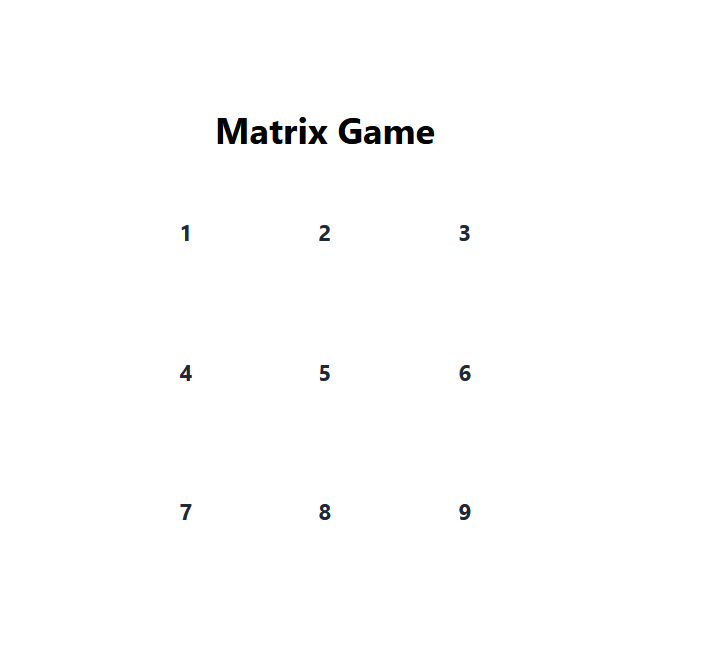
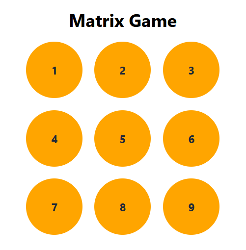

Matrix Game 🎮
A simple interactive game 

1) Clicking on a box to turns it green.
2) Clicking all 9 boxes changes them to orange in the order they were clicked.
3) After all boxes turn orange, the game resets automatically so you can play again.

Installation & Setup
Run these commands on your terminal

1) npm install
2) npm run dev

Screenshot:

